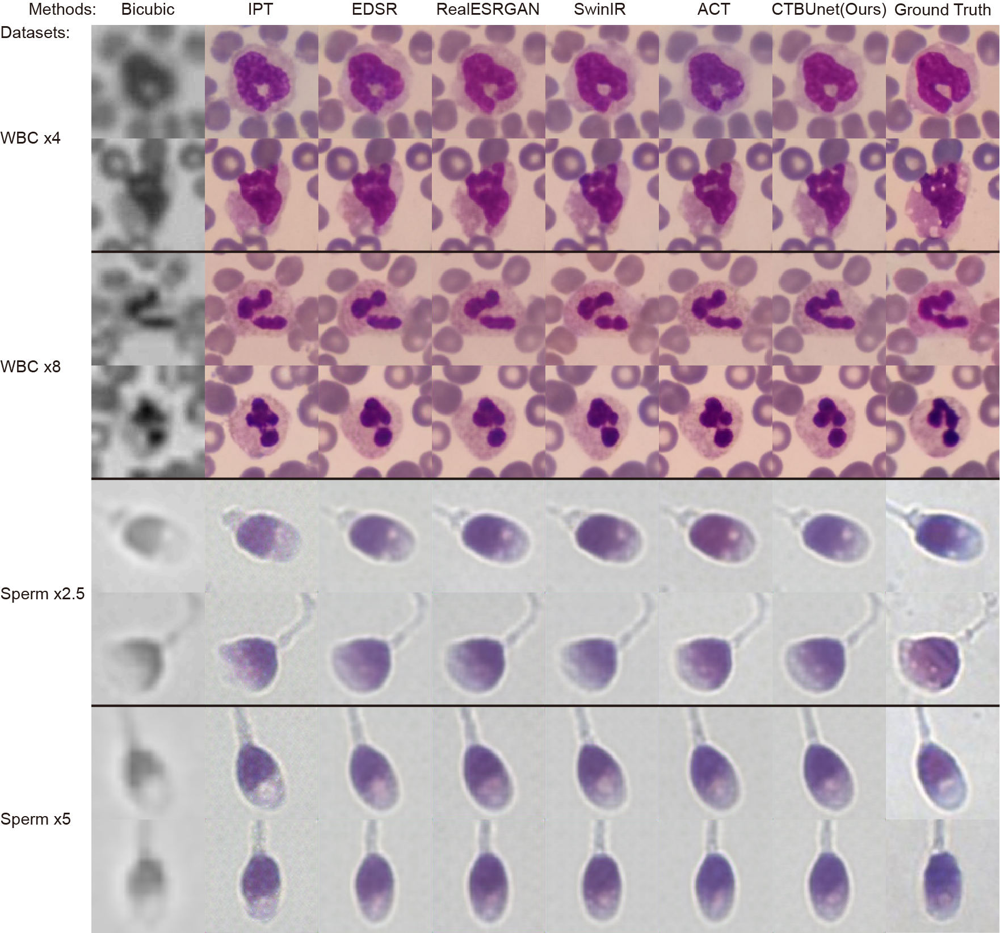
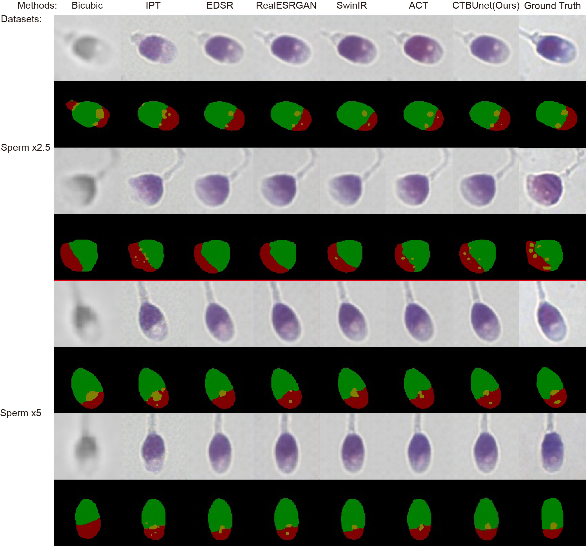

# CTBUnet: A CNN-Transformer Combined Bilateral U-Net for Microscopy Image Enhancement of Live-Cell

## Netword architecture:
<p align="center"></p>

## Sample output:
<p align="center"></p>
<p align="center"></p>

## Dataset
The datasets are in Basicsr-github/datasets

## Installation
- basicsr.1.4.2
- pytorch.2.1.2

## Results and models
**On Synthesized WBC**

|Methods | Scale | PSNR | SSIM | mDice | mIoU |
|--------|-------|------|------|-------|------|
|CTBUnet |  x4   |31.20 |0.8979|0.9310 |0.9215|
|CTBUnet |  x8   |27.36 |0.8239|0.8940 |0.8731|

**On Real-world Sperm**

|Methods | Scale | PSNR | SSIM | mDice | mIoU |
|--------|-------|------|------|-------|------|
|CTBUnet |  x2.5 |25.88 |0.7855|0.6588 |0.6469|
|CTBUnet |  x5   |25.34 |0.7627|0.5909 |0.6076|

## Evaluation

### Pretrained models

The pretrained models are available in [google drive](https://drive.google.com/drive/folders/133aa9GWYe-NnWYjeQ3P-EkS80HJlGkN4?usp=drive_link)

### Evaluation process

```
PYTHONPATH="./:${PYTHONPATH}" CUDA_VISIBLE_DEVICES=0 python basicsr/test.py -opt options/test/CTBUnet/test_CTBUgan_x2.5plus_Sperm_pairdata_no_half.yml
```

## Contact
Should you have any question, please contact chenwy.chen@mail.utoronto.ca


**Acknowledgment:** This code is based on the [BasicSR](https://github.com/xinntao/BasicSR) toolbox